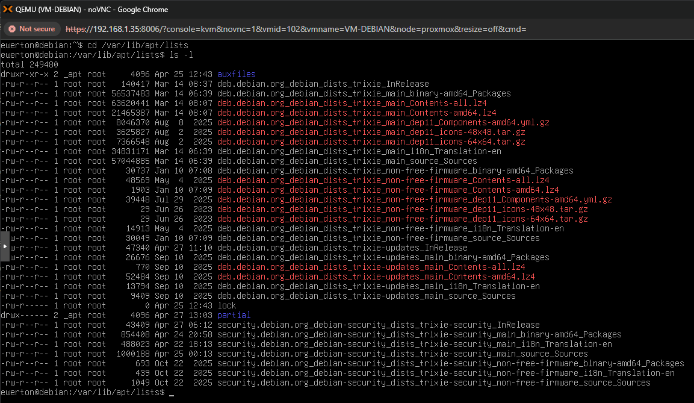
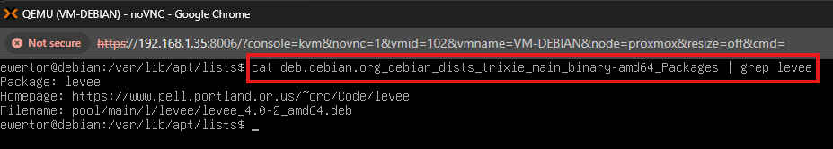
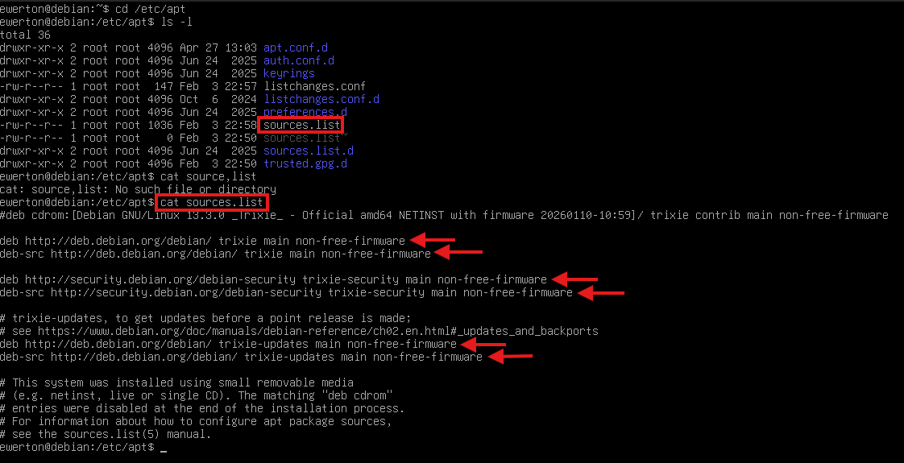
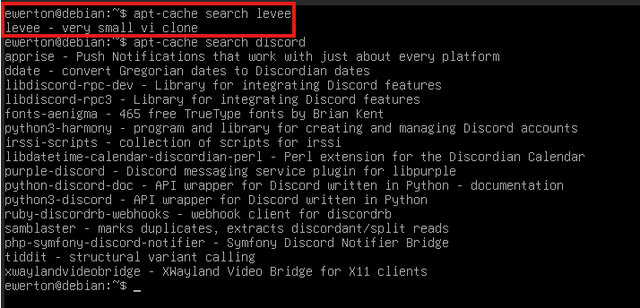
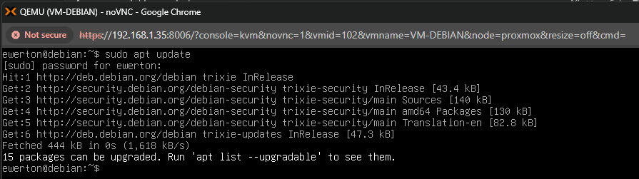
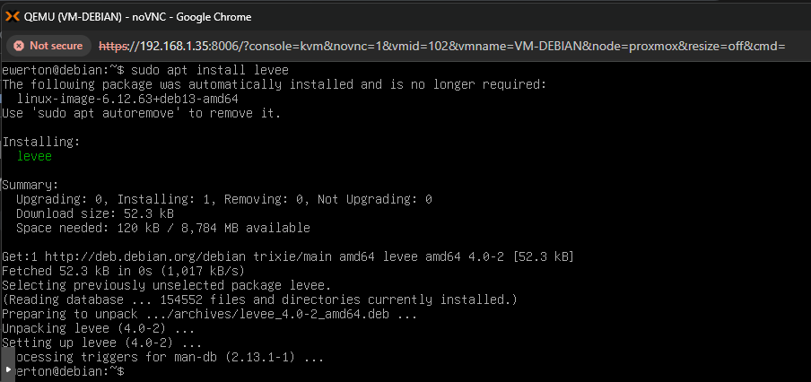
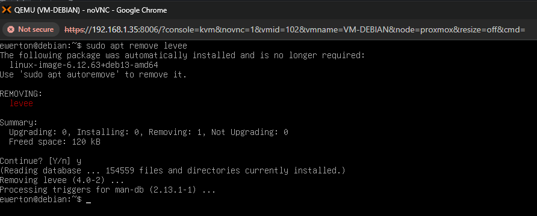
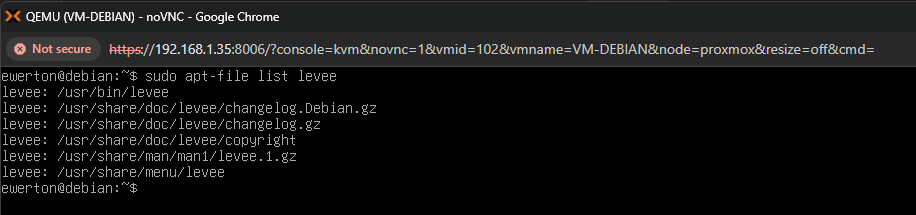
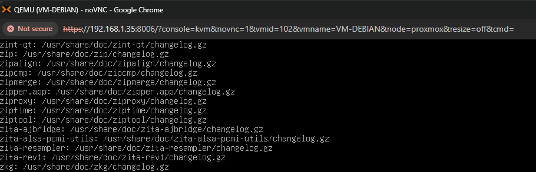

Laboratório: Gerenciando pacotes com a ferramenta APT

Esse laboratório descreve o processo e analise de como funciona o APT e seus parâmetros.

 1. Conceitos fundamentais: O APT é um gerenciador de pacotes igual o DPKG, porém existem diferenças entre eles. Diferente do DPKG, o APT é um sistema de alto nível, ele faz buscas em repositórios, baixa, instala, atualiza, mantém e remove pacotes. O APT também faz a resolução de dependências, isso quer dizer que se o pacote instalado precisar de outro pacote, o APT instalado esse outro pacote antes também.

Para visualizar a onde os pacotes .deb são armazenados quando o comando apt install é utilizado usa-se o comando:

* ls /var/cache/apt/archives

1.1 Análise e entendimento da saída ls. Com base na execução do comando, identificamos:

Arquivos .deb: Pacotes compactados que foram baixados

O Debian guarda esses arquivos por dois motivos principais:

I- Reinstalação rápida: Se você desinstalar um pacote e quiser instalá-lo de novo daqui a cinco minutos, o apt não vai gastar internet. Ele vai olhar nessa pasta, ver que o .deb já está lá e instalar instantaneamente.

II - Segurança em atualizações: Se uma atualização falhar, você ainda tem os pacotes baixados ali para tentar entender o que aconteceu ou reinstalar manualmente via dpkg.

obs: Como é feita várias instalações e upgrade de pacotes, diretório de cache pode ficar cheio. Para liberar espaço você pode usar o comando apt-get clean. Isto removerá o conteúdo de /var/cache/apt/archives e /var/cache/apt/archives/partial 

 2. Entendendo a estrutura dos pacotes .deb

Os pacotes .deb ficam armazenado em repositórios e disponíveis para ser utilizados conforme a necessidade do usuário. Um exemplo de repositório é o http://deb.debian.org/debian. quando o sistema é instalado na máquina, ele não faz o download/instalação de todos os pacotes disponíveis no mundo, pois é algo inviável. O que ele mantém localmente é uma base de dados (cache) com informações sobre os pacotes. O diretório principal é o /var/lib/apt/lists/. Dentro desse diretório existe os índices dos pacotes, esses índices são São arquivos de texto (compactados) que contêm informações como: Nome do pacote, versão disponível, dependências, descrição e
URL de download. Para visualizar o contéudo, usaremos o comando:

* cd /var/lib/apt/lists/
* ls -l lists

 

Analisando a saída do comando ls -l, podemos observar as seguintes informações:

deb.debian.org_debian_dists_trixie_main_binary-amd64_Packages - A lista de TODOS os pacotes disponíveis no repositório main para arquitetura amd64 

deb.debian.org
→ servidor

debian_dists_trixie
→ distribuição

main
→ seção

binary-amd64
→ arquitetura

Packages
→ lista de pacotes

A saída também mostra a lista de outros pacotes com outros objetivos, por exemplo o deb.debian.org_debian_dists_trixie_InRelease que contém metadados do repositório, assinatura e GPG (segurança). 

2.1 Verificando as informações de um pacote em /var/lib/apt/lists/

Dentro do arquivo deb.debian.org_debian_dists_trixie_main_binary-amd64_Packages existe uma enorme quantidade de informações sobre diversos pacotes. Para verificar o índice de um pacote especifico, usa-se o comando:

* cat deb.debian.org_debian_dists_trixie_main_binary-amd64_Packages | grep [pacote]

A saída do comando cat juntamente com o comando grep mostrou o índice que o apt consulta na instalação do pacote levee. Esses índices são: Package, homepage e filename. São essas as informações básicas que o apt precisa para ir até o repositório e fazer o download e instalação do pacote .deb levee. 

2.2 Localizando o diretório dos repositórios

No momento da instalação de algum pacote, utilizando o APT, após localizar o índice do pacote em /var/lib/apt/lists/ ele visualiza os diretórios disponíveis para fazer a busca do pacote e instalar. A informação desses repositórios ficam em /etc/apt/sources.list. Para visualizar o conteúdo, utiliza-se o comando:

* ls /etc/apt/sources.list

 

Analisando a saída do comando ls, é possível ver informações sobre os repositórios disponíveis para o APT. Também existe o diretório sources.list.d, que pode ser utilizado para a adicionar novos repositórios. Após adicionar outro repositório no sistema, é necessário executar o comando apt update.

 3. Pesquisando pacotes com APT. 

É possível utilizar o utilitário apt-cache para fazer buscar por um pacote específico ou um pacote que contém um arquivos em específico. todas essas buscas são feitas no índice dos pacotes. Pode-se utilizar a syntaxe apt-cache search + [padrão de pesquisa]. Isso quer dizer que qualquer palavra digitada, o apt irá percorrer pelos indicies e trazer a lista de todos os pacotes que contêm o padrão, seja em seu nome, descrição ou arquivos fornecidos.

* apt-cache search [nome]

A saída nos mostrou a resposta do apt em relação a palavra levee, é uma informação básica de que esse pacote é um clone muito pequeno do vi. Mas para uma analise melhor, foi utilizado uma palavra que certamente estaria em muitos outros pacotes, que foi a palavra "discord", a partir disso o apt trouxe uma gama de informações de diretórios. Mas observe que o pacote "apprise" em nenhuma momento do texto é citado a palavra discord. Sendo assim, é possível pesquisar pela informação completa do pacote. utilizando o comando:

* apt-cache show apprise

Agora, tendo a informação completa sobre o pacote, é possível ver a palavra Discord na linha Description-en. 

 4. Instalando e removendo pacote

A parte mais simples do gerenciador de pacotes APT é a instalação e remoção de pacotes. Porém antes de fazer a instalação de algum pacote, é uma boa prática atualizar os índices primeiro. Para atualizar o índice dos pacotes e instalá-los e removê-los, se utiliza os comandos:

* sudo apt update

* sudo apt install [pacote]

* sudo apt remove [pacote]

 5. Listando o conteúdo da embalagem e localizando arquivos

Semelhante a alguns parâmetros do DPKG, o APT tem o utilitário apt-file que traz informações dos arquivos dentro de um pacote e qual pacote fornece determinado arquivo. A diferença entre esse dois gerenciadores é que o DPKG só consegue retornar respostas de arquivos e pacotes já pertencentes ao sistema, o APT consegue fazer essa depuração em arquivos ainda não pertencentes ao sistema. Para identificar quais arquivos um pacote tem e onde ficam localizados, se usa o comando:

* sudo apt-file list [pacote]

Agora, para saber qual é o pacote que fornece determinado arquivo no sistema, pode ser utilizado o parâmetro search do utilitário apt-file. A syntaxe é:

* apt-file search [file]

Nessa caso, foi utilizado o arquivo changelog.gz e o apt_file trouxe todos os pacotes que disponibilizaram esse arquivo. 

 

