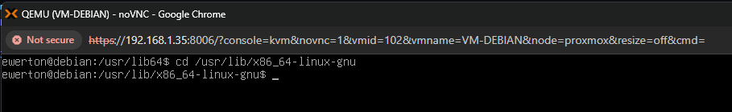
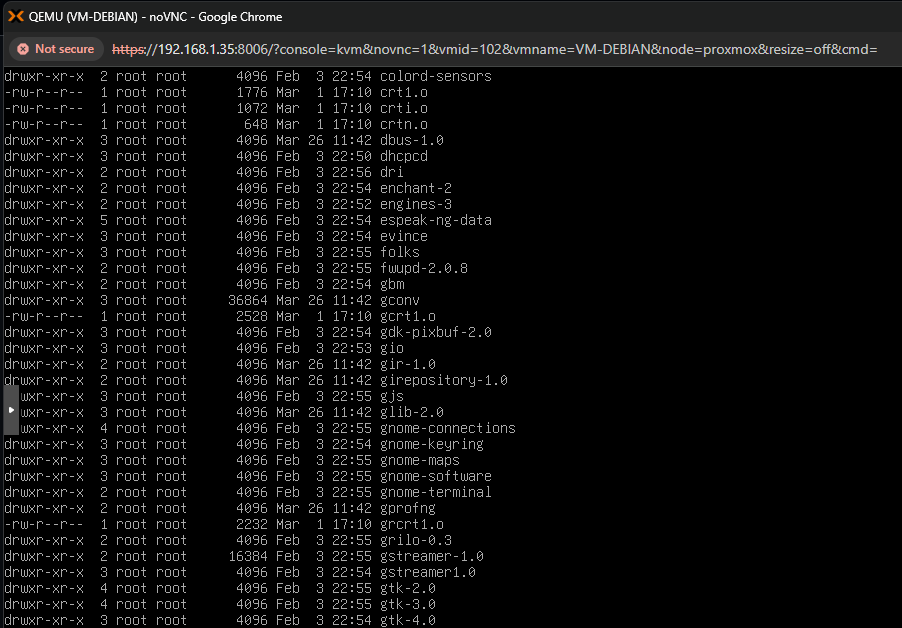
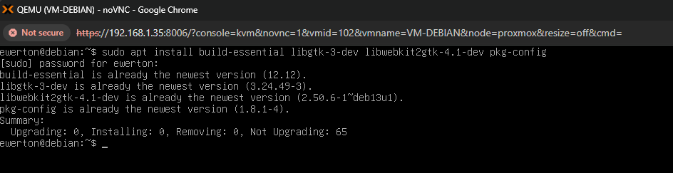
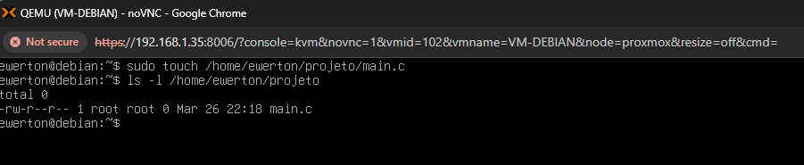
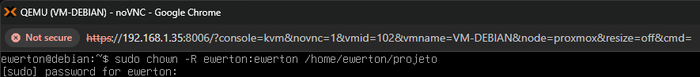
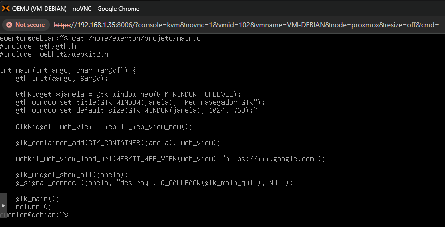
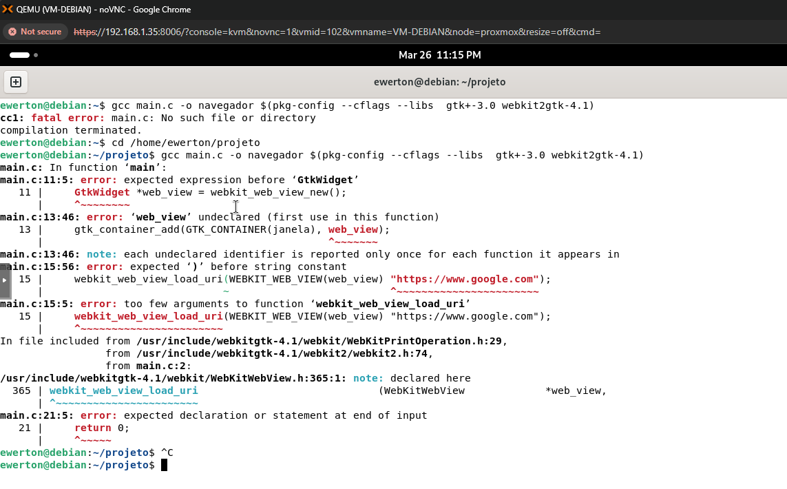
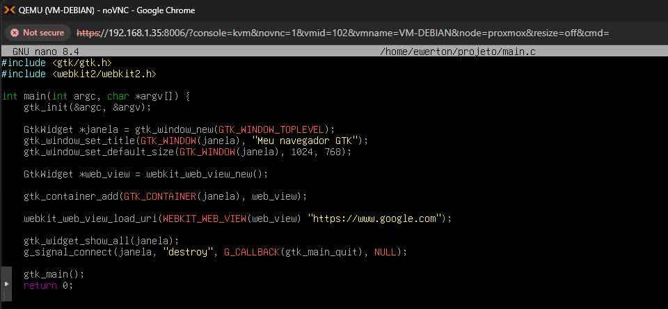
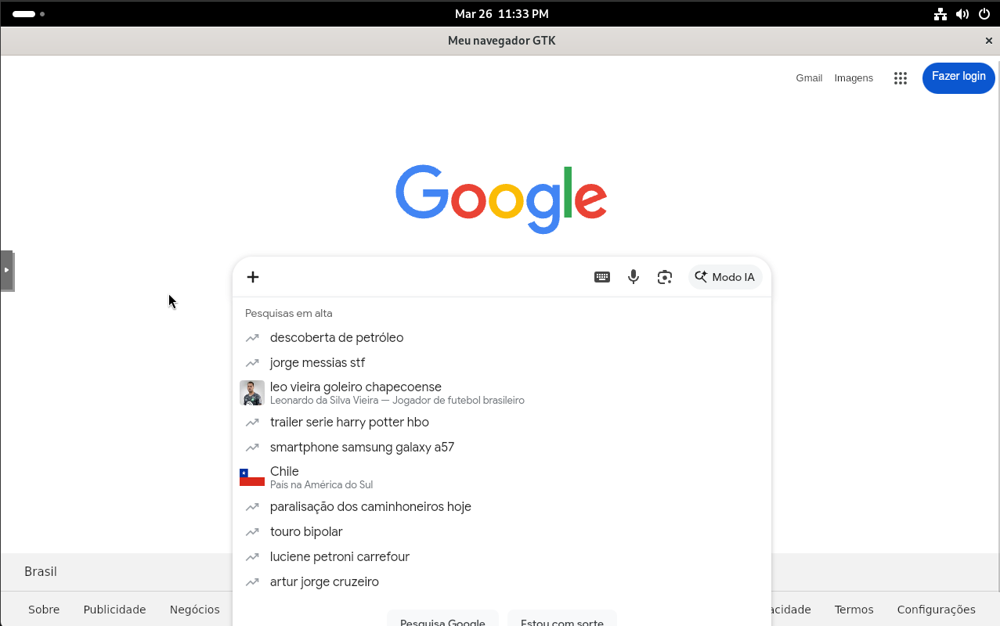
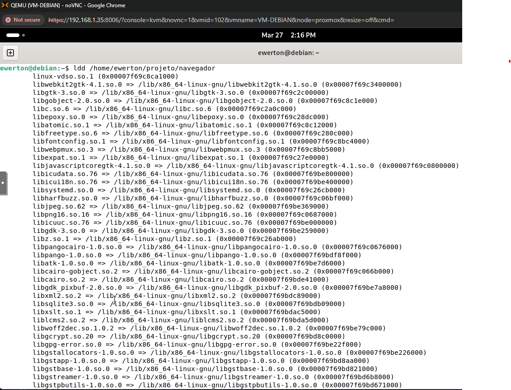

Laboratório: Ciclo de Vida do Executável Linux (C, GCC e ELF)

Este laboratório documenta o processo de criação de código-fonte em linguagem C, a gestão de dependências e a compilação para um executável no formato ELF (Executable and Linkable Format).

 1. Fundamentos e Arquitetura de Bibliotecas

No ecossistema Linux, um executável resulta da compilação de código-fonte e do seu posterior vínculo (linking) a bibliotecas.

Bibliotecas Compartilhadas (.so): São objetos binários carregados em memória apenas quando necessários. Elas permitem que múltiplos programas utilizem o mesmo código simultaneamente, otimizando o uso de RAM e reduzindo o tamanho dos binários em disco.

Carregador Dinâmico (ld.so): Responsável por localizar e mapear essas bibliotecas no espaço de endereçamento do processo durante a execução.

 2. Estrutura de Diretórios de Bibliotecas

As bibliotecas do sistema seguem o padrão FHS (Filesystem Hierarchy Standard). Para identificar onde residem os objetos compartilhados de 64 bits:

/lib64: Link simbólico para /usr/lib64, contém bibliotecas essenciais para o boot.

/usr/lib/x86_64-linux-gnu: Diretório padrão em sistemas baseados em Debian/Ubuntu para bibliotecas de arquitetura específica.

Comandos de exploração:

* cd /usr/lib/x86_64-linux-gnu - Navegar até o diretório de bibliotecas de 64 bits

* ls -l -Listar arquivos de objetos compartilhados

 3. Preparação do Ambiente de Build

Para transformar código em binário, é necessário instalar o conjunto de ferramentas de desenvolvimento (Toolchain).

* sudo apt update
* sudo apt install build-essential libgtk-3-dev libwebkit2gtk-4.1-dev pkg-config

Componentes Instalados:

build-essential: Inclui o gcc (compilador), make e as bibliotecas base da libc.

libgtk-3-dev & libwebkit2gtk-4.1-dev: Fornecem os headers (.h) e arquivos de desenvolvimento necessários para chamadas de funções gráficas e de renderização web.

pkg-config: Ferramenta indispensável que automatiza a inserção de flags de compilação e caminhos de bibliotecas para o compilador.

 4. Criação de de arquivo C

Após a instalação das ferramentas necessárias, foi criado um diretório projeto e dentro desse diretório um arquivo com a extensão .c

* sudo touch /home/ewerton/projeto/main.c

 5. Gestão de Permissões

Para garantir que o processo de escrita e compilação ocorra sem conflitos de privilégios no diretório do projeto:

* sudo chown -R ewerton:ewerton /home/ewerton/projeto

 6. Desenvolvimento do Código-Fonte

O arquivo main.c utiliza a biblioteca GTK para a interface de janela e a WebKitGTK para renderizar o motor de busca do Google. O objetivo aqui é observar como o código faz referência a símbolos externos que serão resolvidos na compilação.

Código:

7. Compilação e Vinculação (Linking) com erro

A compilação é realizada invocando o gcc e utilizando o pkg-config para resolver as dependências das bibliotecas gráficas.

* gcc main.c -o navegador $(pkg-config --cflags --libs gtk+-3.0 webkit2gtk-4.1)

Após executar o comando, o output mostrou alguns erros de syntaxe do código. 

-o navegador: Define o nome do binário de saída.

--cflags: Inclui os caminhos dos cabeçalhos.

--libs: Indica quais bibliotecas o linker deve associar ao executável.

 8. Correção de syntaxe

 A compilação não foi executada, pois tinham alguns erros como falta de vírgula, acento til colocado erroneamente, falta de chaves no final do código. Feito todas as correções e executado o comando novamente.

 

  9. Validação do executável ELF

Após a compilação ser efeutada com sucesso, em /home/ewerton/projeto terá um binário com nome de 'navegador'. a partir disso, o programa está pronto para ser executado. 

* ls -l /home/ewerton/projeto

 10. Execução e Análise de Dependências

Para executar aplicações gráficas a partir do terminal puro (TTY), é necessário subir o Debian para interface gráfica e executar o programa:

* sudo systemctl isolate graphical.target

Após mudar para a interface gráfica, executar o programa em /home/ewerton/projeto/navegador:

 11. Inspeção de Dependências Dinâmicas

Para validar quais bibliotecas o executável "navegador" está solicitando ao sistema em tempo de execução, utilizamos o comando ldd:

* ldd /home/ewerton/projeto/navegador

Este comando exibirá o mapeamento de cada biblioteca .so necessária e o endereço de memória onde o carregador planeja encontrá-la.

