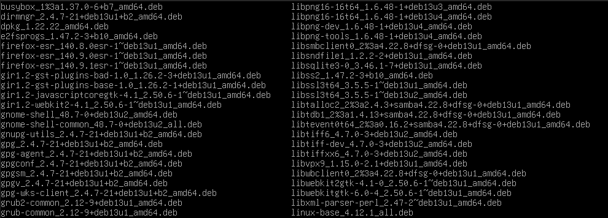
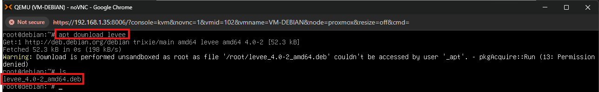
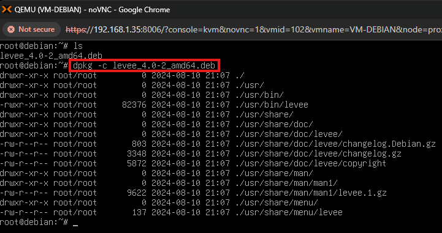
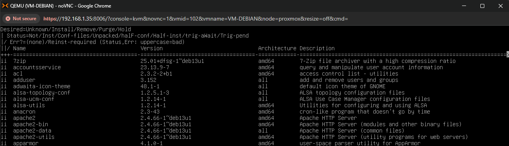
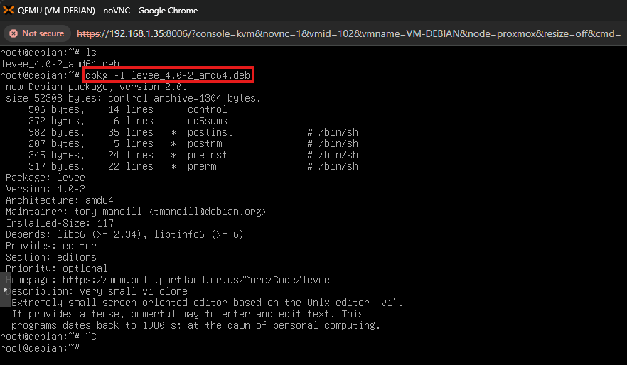
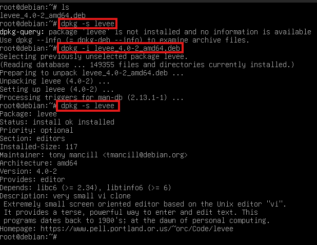
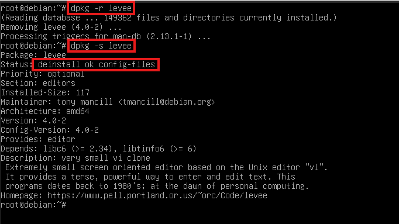

Laboratório: Gerenciando pacotes com a ferramenta DPKG

Esse laboratório descreve o processo e analise de como funciona o DPKG e seus parâmetros. 

 1. Conceitos fundamentais: DPKG é uma ferramenta de baixo nível, diferente do APT, ele não entende repósitorios, ele só instala, remove, mantém e gerencia pacotes já instalados na máquina.

Para visualizar a onde os pacotes .deb são armazenados quando o comando apt install é utilizado usa-se o comando:

* ls /var/cache/apt/archives

1.1 Análise e entendimento da saída ls. Com base na execução do comando, identificamos:

Arquivos .deb: Pacotes compactados que foram baixados

O Debian guarda esses arquivos por dois motivos principais:

I- Reinstalação rápida: Se você desinstalar um pacote e quiser instalá-lo de novo daqui a cinco minutos, o apt não vai gastar internet. Ele vai olhar nessa pasta, ver que o .deb já está lá e instalar instantaneamente.

II - Segurança em atualizações: Se uma atualização falhar, você ainda tem os pacotes baixados ali para tentar entender o que aconteceu ou reinstalar manualmente via dpkg.

 2. Intalando pacote e gerenciando com DPKG

Para um ambiente mais controlado, um pacote foi baixado em /root, mas vale ressaltar que não é uma boa prática para o dia a dia. Para baixar um pacote utiliza-se o comando:

* apt download [pacote]

2.1 Análise e entendimento da saída apr download. Com base na execução do comando, observamos:

- Downalod efetuado, mas a instalação automática com pacote não foi executada.
- Após a execução do comando foi emitido um warning na tela.

O motivo do aviso é porque durante o download de pacotes, o apt utiliza o usuário restrito _apt, reduzindo privilégios como medida de segurança para mitigar possíveis impactos de conteúdos maliciosos.

Entretanto, ao armazenar o pacote em /root, o usuário _apt não possui permissões de escrita nesse diretório. Como consequência, o processo é assumido pelo próprio apt com privilégios elevados, gerando um warning indicando que o mecanismo padrão de isolamento (sandbox) não pôde ser aplicado.

 3. Gerenciado o pacote com DPKG

Com o pacote no sistema, é possível gerenciar ele com alguns parâmetros. Para saber sobre todos os parâmetros possíveis, execute o comando man dpkg. Os parâmetros utilizados nesse laboratório foram:

-c, -l, -I, -i, -s

3.1 Utilizando -c 

* dpkg -c levee_4.0-2_amd64.deb

Esse paramâtro retorna a informação dos arquivos que serão instalados e onde eles serão instalados. a utilização dessa comando é importante, pois ele mostra se o pacote seguirá os padrões FHS (Filesystem Hierarchy Standard), que é é um conjunto de diretrizes que define a estrutura de pastas e a localização de arquivos em sistemas operacionais Unix-like, como o Linux e as permissões que esses arquivos irão ter. Por exemplo, o binário de um executável precisa ser armazenado em /usr/bin. Caso ele esteja projetado ser ser armazenado em /root, o pacote pode ser malicioso. 

 3.2 Utilizando -l 

 * dpkg -l

O dpkg -l olha apenas para o "inventário físico". Ele lê o arquivo /var/lib/dpkg/status, que é o banco de dados oficial de tudo o que foi descompactado no HD.

O que ele mostra: Apenas pacotes que passaram (ou tentaram passar) pelo sistema.

Estados detalhados: Ele mostra se o pacote está instalado (ii), se foi removido mas deixou arquivos de configuração (rc), ou se a instalação falhou (iF).

Internet: Ele não sabe o que existe na internet. Se procurar por um pacote que existe no repositório mas nunca foi baixado, o dpkg -l dirá que não encontrou nada.

 3.3 Utilizando -I

 * dpkg -I levee_4.0-2_amd64.deb

Esse parâmetro trás informações gerais sobre o pacote, informações que incluem: 

I - Estrutura interna do .deb

version 2.0 → versão do formato do pacote .deb (não é do programa)
size → tamanho total do arquivo
control archive → parte interna que guarda metadados (tipo “cabeçalho”) 

II - Arquivos de controle

control → informações do pacote (nome, versão, dependências)
md5sums → hashes dos arquivos (integridade)
preinst → roda antes da instalação
postinst → roda depois da instalação
prerm → roda antes de remover
postrm → roda depois de remover

Dentro do .deb existem duas partes principais:

data.tar → arquivos que vão para o sistema (/usr/bin, /etc, etc.)
control.tar → esses arquivos que apareceram com -I

Ou seja:

dpkg -c → mostra o data (arquivos que serão instalados)
dpkg -I → mostra o control (metadados + scripts)

III. Informações principais do pacote

Package → nome
Version → versão do software
Architecture → arquitetura (64 bits aqui)

IV. Mantenedor

Maintainer: tony mancill <tmancill@debian.org>

V. Status e dependências

Installed-Size → espaço que vai ocupar depois de instalado (em KB)
Depends → dependências obrigatórias

3.4 Utilizando -i e -s

* dpkg -s levee_4.0-2_amd64.deb
* dpkg -i levee_4.0-2_amd64.deb

Usando primeiro o parâmetro -s, ele informa que o pacote não está instalado e que as iformações sobre o pacote não está disponível. Então usando o parâmetro -i e instalando o pacote, foi possível utilizar o -s. É possível observar que o parâmetro -s possui algumas informações que também são mostradas no parâmetro -I, porém existe uma diferença entre eles. 

I - dpkg -I (Info de arquivo):

O -I (i maiúsculo) é usado para interrogar um arquivo .deb que fpo baixado, mas que ainda não foi necessariamente instalado.

Alvo: O arquivo físico (ex: levee_4.0-2_amd64.deb).

Scripts de Controle: Ele é o único que mostra os metadados internos e os scripts de controle (como preinst, postinst, prerm), que são as instruções que o Debian executa antes ou depois da instalação.

Uso Comum: Verificar as dependências de um programa antes de decidir instalá-lo.

II - dpkg -s (status de pacote)

O -s (s minúsculo) consulta o banco de dados local do seu sistema (/var/lib/dpkg/status) para saber a situação de um pacote que o sistema já conhece.

Alvo: O nome do pacote no sistema (ex: levee_4.0-2_amd64.deb).

Informação de Instalação: Ele informa se o pacote está "Install ok installed", a versão atual instalada e o espaço que ele está ocupando no disco agora.

Limitação: Se o pacote não estiver instalado (ou se você tentar apontar para um arquivo .deb), o comando falhará.

3.4 Utilizando -r

O parâmetro -r é utilizado para desintalar o pacote do sistema, porém se utilizar o -s novamente, ele já não só retorna a informação de que não está instalado e que não tem informações. Como o pacote foi instalado, ele foi para o banco de dados do dpkg (/var/lib/dpkg/status). Com isso o -s consegue ir até o banco de dados e buscar as informações, principalmente que o pacote não está instalado. 

 

